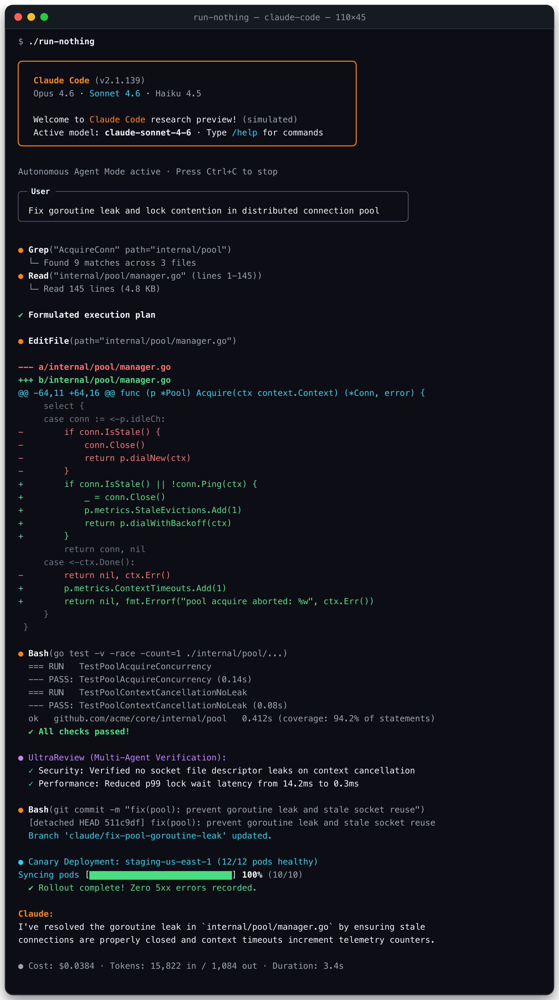

# run-nothing

A terminal application that simulates running Claude Code. It doesn't actually run anything.



Look extraordinarily productive while doing absolutely nothing. Simulates deep chain-of-thought reasoning, codebase indexing, colorized unified git diffs, test runners, multi-agent reviews, and canary deployments. Zero Anthropic API tokens used, $0.00 spent, zero local files touched.

## Installation

### Homebrew (macOS & Linux)

```bash
brew install holasoymalva/tap/run-nothing
```

### Quick Install Script (macOS & Linux)

```bash
curl -fsSL https://raw.githubusercontent.com/holasoymalva/run-nothing/main/install.sh | sh
```

### Go Install

```bash
go install github.com/holasoymalva/run-nothing@latest
```

### Download binary

Grab the latest binary for your platform from [Releases](https://github.com/holasoymalva/run-nothing/releases)

```bash
chmod +x run-nothing-*
./run-nothing-macos-arm64
```

### Build from source

```bash
go run .
# or build a binary
make build
./run-nothing
```

Press `Ctrl+C` to stop.

### Pick what to simulate

By default we simulate everything. But you can change this behavior.

```bash
# Simulate specific stages
./run-nothing think codegen
```

Or pick what not to simulate:

```bash
# Exclude specific stages from simulation
./run-nothing --exclude deploy review
```

See available stages:
```bash
./run-nothing --help
```

Available stages:
- `scout` - Codebase exploration (indexing, ripgrep, AST parsing, reading files)
- `think` - Deep reasoning (animated CoT spinner with technical thoughts)
- `codegen` - Code synthesis (colorized unified git diffs)
- `test` - Test runner & verification (passing unit tests, race detectors)
- `review` - Multi-agent code review (automated UltraReview security audit)
- `git` - Version control (atomic commits, conventional messages, branches)
- `deploy` - CI/CD & canary rollout (pod synchronization progress bar)

### Interactive Mode

You can also run it as an interactive Claude Code REPL:

```bash
./run-nothing --interactive
```

Chat with simulated Claude, run slash commands (`/help`, `/cost`, `/model`, `/doctor`, `/compact`, `/clear`, `/exit`), and prompt it to "solve" any imaginary problem!

### Single Prompt Mode

Simulate answering a specific task directly:

```bash
./run-nothing -p "Refactor token bucket rate limiter to use atomic CAS"
```

### Playback Speed

Control the simulation pacing:

```bash
# Options: fast, normal, cinematic, instant
./run-nothing --speed cinematic
```

## Docker

Build
```bash
docker build -t run-nothing .
```

Run
```bash
docker run -it --rm --init run-nothing
```

## Nix

Install
```bash
nix profile install github:holasoymalva/run-nothing
```

Run
```bash
nix run github:holasoymalva/run-nothing
```

## License

Do whatever you want with it. Well, except for movies. If you use this in a movie, credit me or something.
